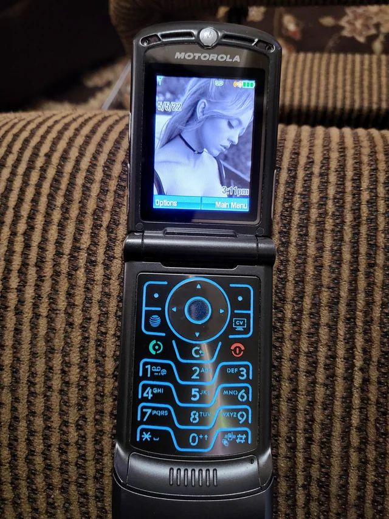

# Motorola RAZR V3i (R4441D)



Flash MMPAGI v0.5 via RSD Lite in a Windows QEMU VM with USB passthrough.

Bootloader mode: power off → hold `*#` → red button.

## NixOS udev rule

```nix
SUBSYSTEM=="usb", ENV{DEVTYPE}=="usb_device", \
  ATTRS{idVendor}=="22b8", ATTRS{idProduct}=="4903", \
  GROUP="qemuusb", MODE="0660"
```

## QEMU flag

```
-device usb-host,vendorid=0x22b8,productid=0x4903
```

## Commands

`*#06#` IMEI | `*#9999#` Software version | `*#8888#` Hardware version

## Links

### Firmware/Lang Packs

- [MMPAGI v0.5 (R4441D, has Russian)](https://forum.motofan.ru/index.php?showtopic=136497)
- [R4441D_G_08.02.05R stock (no Russian)](https://motofan.ru/downloads/100857/)
- [LP0032 reflash](https://gsmforum.ru/threads/32190/)

### Tools

- [RSD Lite](https://firmware.center/software/Motorola/Flashing/Official/RSD%20Lite/)
- [Motorola P2K Drivers](https://archive.org/details/motorola_p2k_drivers)
- [P2K Easy Tool 3.9](https://archive.org/details/p-2-k-easy-tool)
- [P2K Tools 3](https://firmware.center/software/Motorola/Viewing/P2K%20Tools%203/)

### Reference

- [MMPAGI forum thread](https://forum.motofan.ru/index.php?showtopic=136497)
- [GSMForum R4441D langpacks](https://gsmforum.ru/threads/32190/)
- [R4441D to R479 cross-flash](http://matrax.net/forum/showthread.php?p=628441)
- [Language pack codes](https://a9fm.blogspot.com/2010/01/motorola-language-packs-with.html)
- [Java games 240x320](http://dedomil.net/games/category/3)
